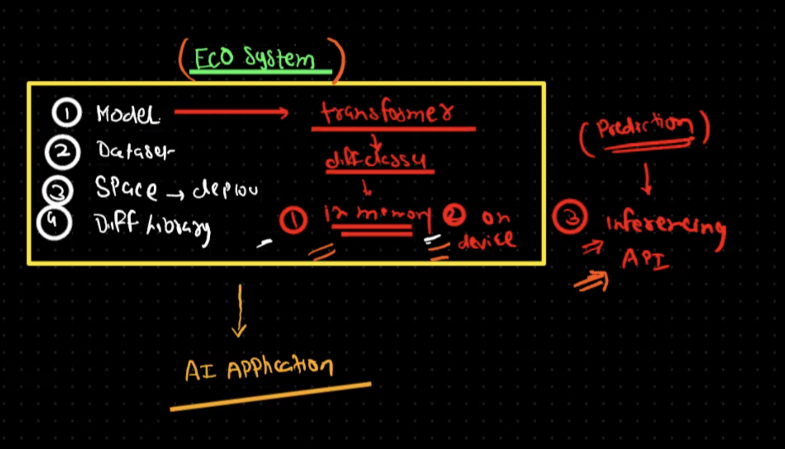
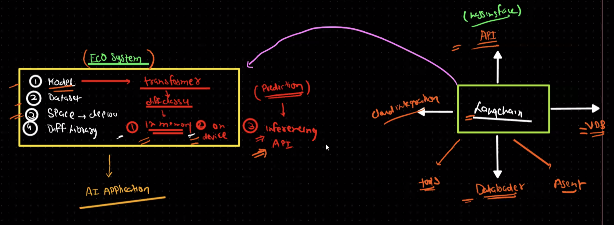

# Hugging Face 

## Libraries
1. Transformer -> To use transformer based model
2. Pipeline
    - Text generation
    - Summarization
    - Sentiment analysis 
    - Custom Model 
3. AutoTokenizerClass
4. AutoModelForSequenceClassification -> To load sequence Classification model
5. 

